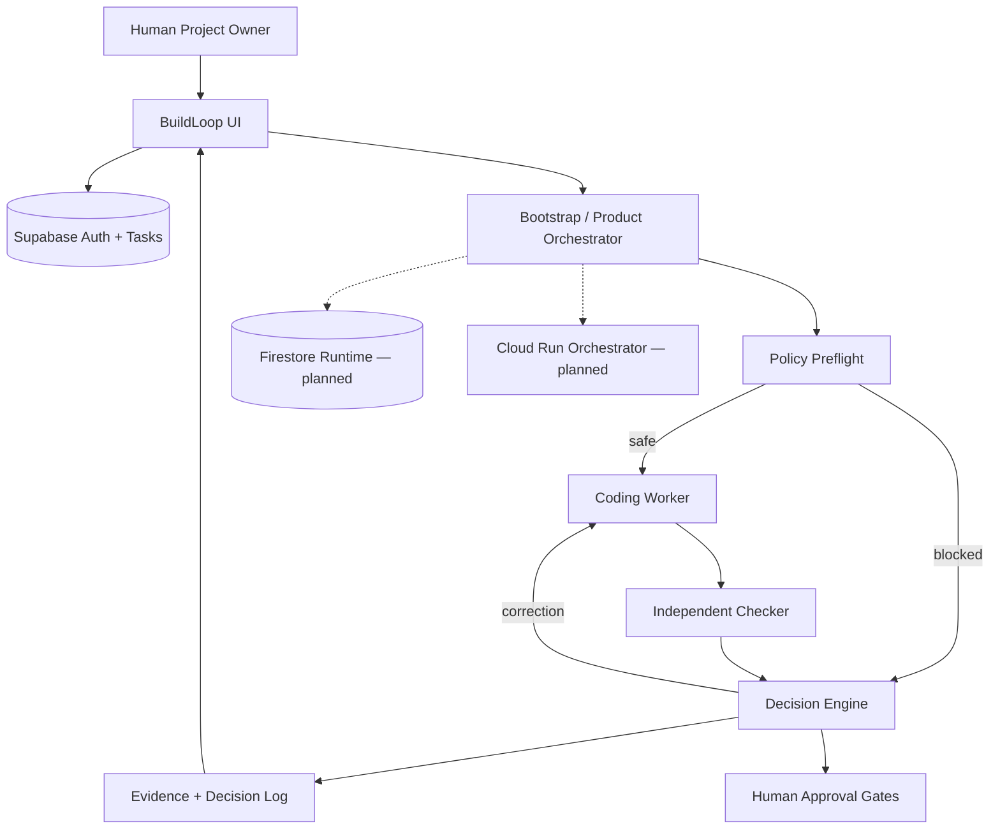

# BuildLoop Architecture

## Role separation

| Component | Responsibility |
|-----------|----------------|
| Orchestrator | State machine, preflight, verdict from evidence |
| Coding Worker | Patches in sandbox (`demo-worker`, future `gemini-worker`) |
| Independent Checker | Read-only deterministic checks |
| Human | Execute / commit / push / merge / deploy approval |

## Persistence boundaries

- **Supabase**: authentication, tasks, contracts, execution approval log
- **Local `.buildloop/`**: sandbox runs, manifest revisions (dev)
- **Firestore** (planned): runs, attempts, checker evidence, decision logs

## Demo scenarios

- **PASS**: workspace copy task with one correction → `AWAITING_APPROVAL`
- **BLOCKED**: credential/deployment/main branch goal → preflight, worker calls = 0
