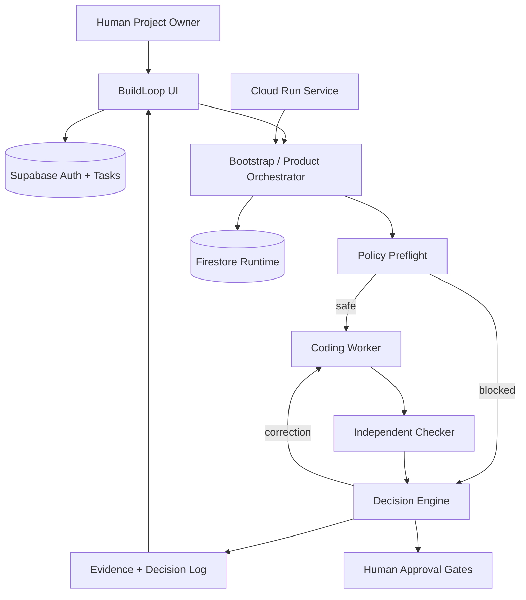

# BuildLoop Architecture

## Verification status (documentation)

| Layer | Status | Evidence |
| ----- | ------ | -------- |
| Orchestrator, checker, PASS/BLOCKED demos | **Implemented + tested locally** | `src/orchestrator/`, `scenario-validation.test.ts`, CLI demos |
| Google ADK + Gemini worker | **Implemented in repository** | `src/orchestrator/adk/gemini-agent.ts`, model `gemini-3.6-flash` |
| Firestore runtime persistence | **Implemented + tested** | `firestore-store.ts`, collection `buildloopRuns`; live `/ready` reports `persistence: firestore` |
| Cloud Run hosted app | **Deployed + verified live** | `Dockerfile`, `cloudbuild.yaml`, [AGENTS.md](../AGENTS.md); `/ready` on public URL |
| Contract versioning (Edit Plan) | **Implemented + tested** | `task-mutations.ts`, `task-edit-plan.test.ts`; persisted in Supabase `tasks.contract` JSONB |

## Role separation

| Component | Responsibility |
| --------- | -------------- |
| Orchestrator | State machine, preflight, verdict from evidence |
| Coding Worker | Patches in sandbox (`demo-worker` for CLI demos; `adk-gemini-worker` for real tasks via Google ADK) |
| Independent Checker | Read-only deterministic checks; never mutates code |
| Human | Execute / commit / push / merge / deploy approval; protected-path approval when runtime writes hit governed paths |

## Persistence boundaries

| Store | Purpose |
| ----- | ------- |
| **Supabase** | Authentication, projects, tasks, human approvals. Task contracts live in `tasks.contract` (JSONB), including `contractVersion` and optional `contractHistory[]` snapshots after Edit Plan revisions. |
| **Firestore** | Orchestrator runtime when `BUILDLOOP_PERSISTENCE=firestore`: run records, checker evidence, decision logs in collection **`buildloopRuns`**. Each run stores the `contractVersion` used at execution time. |
| **Local `.buildloop/`** | Dev task store (`.buildloop/dev-tasks.json` when using dev auth bypass), sandbox worktrees, checkpoints, and local persistence when `BUILDLOOP_PERSISTENCE=local` (default for CLI demos). |

### Contract versioning (task row)

Edit Plan preserves the **same task ID** and increments **`contractVersion`** (v1 → v2 → v3) on each draft revision. Before incrementing, the prior contract summary is appended to **`contractHistory`** inside the task's `contract` JSON:

- `version`, `goal`, `acceptanceCriteria`, `inScope`, `sourceCommitSha`, `lockedAt`, `createdAt`

This is **not** a separate contracts table. Clarification-only answers do not increment the version. Verified in dev and Supabase repositories via shared `applyDraftUpdate` / `updateDraftTask` paths.

## Core workflow

1. Task goal → deterministic planning → contract draft
2. Policy preflight (`detectSensitiveIntent`) → BLOCKED before worker if sensitive
3. Coding worker in isolated sandbox/worktree
4. Independent checker → structured evidence
5. Bounded correction loop (default max **2** attempts)
6. Verdict: `PASS` / `FAILED` / `BLOCKED`
7. Human approval for commit, push, merge, deploy, and runtime protected-path writes

## Demo scenarios

Reproduce from repository (see [README](../README.md) § Reproducible Testing):

| Scenario | Command | Expected |
| -------- | ------- | -------- |
| **PASS** | `bun run orchestrator:demo:pass` | `verdict: PASS`, `correctionCount: 1`, sandbox-only changes; requires clean Git working tree for CLI |
| **BLOCKED** | `bun run orchestrator:demo:blocked` | `verdict: BLOCKED`, `workerCalls: 0`, preflight stops deployment/credential/main-branch intent |

CLI PASS uses deterministic `demo-worker` (no `GEMINI_API_KEY`). Real UI tasks use `adk-gemini-worker` when `GEMINI_API_KEY` is configured.

## Google Cloud (hosted)

- **Service:** Cloud Run `buildloop`, region `asia-southeast1`, project `buildloop-hackathon-2026`
- **Public URL:** https://buildloop-151062816499.asia-southeast1.run.app
- **Health:** `/health` (liveness), `/ready` (environment validation, persistence mode, Gemini configuration)
- **Deploy:** Canonical flow in [AGENTS.md](../AGENTS.md)
